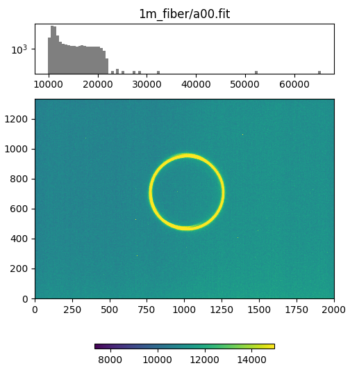
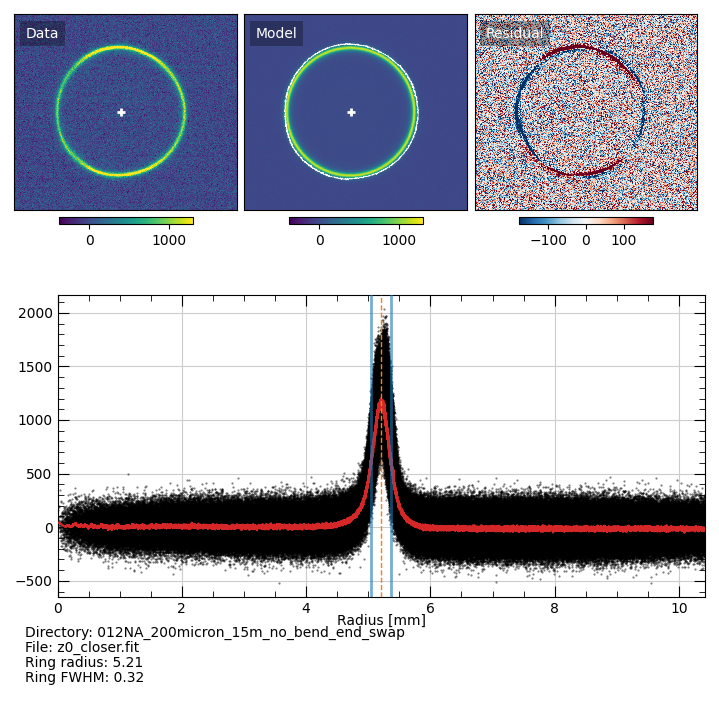
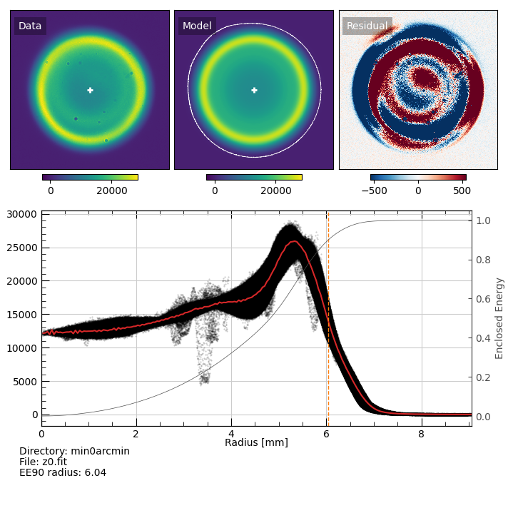

.. include:: include/links.rst

FiberLab Scripts
================

.. contents:: 
    :depth: 1
    :local:

----

Browse Images
-------------

``fiberlab_browse_images`` is a simple utility that lets you browse all the
images in a given directory.

The script usage can be displayed by calling the script with the
``-h`` option:

.. include:: help/fiberlab_browse_images.rst

The script trolls through the directory you point it two and shows you the
following image:

   Image from ``fiberlab_browse_images`` with the observed image and colorbar at
   the bottom and a histrogram of the pixel values at the top with the image
   name.

----

Analysis of far-field output images from collimated input
---------------------------------------------------------

``fiberlab_collimated_farfield`` analyzes a single far-field image from a
collimated input beam.

The script usage can be displayed by calling the script with the
``-h`` option:

.. include:: help/fiberlab_collimated_farfield.rst

You provide the image to analyze and (optionally) a background image and it will
measure the properties of the image.  It can either write the QA image to a
file, or simply open a window with the result.  An example call might be:

.. code-block:: bash

    fiberlab_collimated_farfield z0_closer.fit -b bg0.fit -t 2. -w

which will produce an image that looks like this:

   QA plot from ``fiberlab_collimated_farfield``.  Top-left is the observed
   data, top-center is the "model", and top-right is the difference, which is
   meant to accentuate non-axisymmetries in the data.  The white cross in the
   top-left and top-center panels show the measured center of the ring measured
   using the white contour in the top-center panel.  The white contour is for
   the *observed* data, but it is shown in the model panel so that it doesn't
   obscure inspection of the observed data.  The bottom panel shows the radial
   distribution of the flux, centered on the white cross.  The black points are
   the measured data, the red line is the result of applying a Savitzky-Golay
   filter to the data, the blue lines mark the measured FWHM of the ring
   profile, and the dashed orange line mark the peak value.
   
The script also prints the measured results:

.. code-block:: console

    # Result from fobos_collimated_farfield script
    # Written: Mon 03 Oct 2022 12:50:18
    # Image file: z0_closer.fit
    # Pixelsize: 0.018 mm
    # Ring radius:    2.45
    # Ring peak flux: 1219.00
    # Ring FWHM:      0.54

You can analyze a typical dataset collected for focal-ratio-degradation
measurements using ``fiberlab_collimated_FRD``.

The script usage can be displayed by calling the script with the
``-h`` option:

.. include:: help/fiberlab_collimated_farfield.rst

It expects to find two images called ``z0*`` and ``z1*`` that are used to
calibrate the distance from the fiber output to the ``z1*`` image, and then a
series of ``a*`` images that provide far-field images with different input
angles.  QA plots like the one above are produced for all images, and the
measurements are provided in a fixed-width ascii table, which looks like this:

.. code-block:: console

    # Result from fobos_collimated_FRD script
    # Written: Fri 09 Sep 2022 08:23:35
    #
    # Top-level directory: /Users/westfall/Work/FOBOS/akamai/2022/ssl_tests/2022_07_19/012NA_200micron_15m_no_bend_end_swap
    #
    # Pixelsize: 0.018 mm
    # Z image separation: 3.81 mm
    #
    # Z0 image:
    #     File:           z0_closer.fit
    #     Background:     bg0.fit
    #     S/N Threshold:  2.0
    #     Ring radius:    5.21
    #     Ring peak flux: 809.00
    #     Ring FWHM:      0.32
    # Z1 image:
    #     File:           z1_farther.fit
    #     Background:     bg0.fit
    #     S/N Threshold:  1.5
    #     Ring radius:    6.10
    #     Ring peak flux: 704.00
    #     Ring FWHM:      0.37
    #
    # Distance from fiber output to z1 image: 26.04 mm
    #
    # Angle sweep results
    # Radius and FWHM are in degrees.
    #
    #            FILE             BKG THRESH       PEAK      RAD     FWHM
              a00.fit         bg0.fit    1.5   1.28e+03   12.415    0.868
              a01.fit         bg0.fit    3.0   1.65e+03   11.664    0.638
              a02.fit         bg0.fit    3.0   2.55e+03   11.153    0.648
              a03.fit         bg0.fit   10.0   3.03e+03   10.840    0.643
              a04.fit         bg0.fit   10.0   4.27e+03   10.389    0.768
              a05.fit         bg0.fit   10.0   4.61e+03    9.894    1.130
              a06.fit         bg0.fit   10.0   8.86e+03    8.786    0.821
              a07.fit         bg0.fit   10.0   8.91e+03    8.219    0.853
              a08.fit         bg0.fit   10.0   1.04e+04    7.375    1.215
              a09.fit         bg0.fit   10.0   1.67e+04    6.779    1.439
              a12.fit         bg0.fit   10.0   2.29e+04    6.496    1.505
              a13.fit         bg0.fit   10.0   3.16e+04    6.427    1.242
              a14.fit         bg0.fit   10.0   3.79e+04    5.968    1.176
              a15.fit         bg0.fit   10.0   3.52e+04    5.430    1.334
              a16.fit         bg0.fit   10.0   3.20e+04    4.876    1.652
              a17.fit         bg0.fit   10.0   2.77e+04    4.117    2.367
              a18.fit         bg0.fit   10.0   2.83e+04    3.406    3.378
              a19.fit         bg0.fit   10.0   3.15e+04    2.628    4.173

----

Analysis of far-field output images from full-cone input
--------------------------------------------------------

``fiberlab_fullcone_farfield`` works similarly to
``fiberlab_collimated_farfield``, but analyzes a single far-field image from a
full-cone input beam.

The script usage can be displayed by calling the script with the
``-h`` option:

.. include:: help/fiberlab_fullcone_farfield.rst

You provide the image to analyze and (optionally) a background image and it will
measure the properties of the image.  It can either write the QA image to a
file, or simply open a window with the result.  An example call might be:

.. code-block:: bash

    fiberlab_fullcone_farfield z0.fit -b bg/bg.fit -t 10. -w -r 1.4

which will produce an image that looks like this:

   QA plot from ``fiberlab_fullcone_farfield``.  Top-left is the observed data,
   top-center is the "model", and top-right is the difference, which is meant to
   accentuate non-axisymmetries in the data.  The white cross in the top-left
   and top-center panels show the measured center of the output beam measured
   using the white contour in the top-center panel.  The white contour is for
   the *observed* data, but it is shown in the model panel so that it doesn't
   obscure inspection of the observed data.  The bottom panel shows the radial
   distribution of the flux, centered on the white cross.  The black points are
   the measured data, the red line is a smoothed version of the data, the gray
   lines is the normalized enclosed energy curve, and the orange dashed line is
   the radius that encloses 90% of the light (EE90).

To produce EE curves with radii that can be converted to output f/#, use
``fiberlab_fullcone_ee_fratio``.  

The script usage can be displayed by calling the script with the
``-h`` option:

.. include:: help/fiberlab_fullcone_ee_fratio.rst

It expects to find two images called ``z0*`` and ``z1*`` that are used to
calibrate the distance from the fiber output to the camera.  You provide the
top-level directory (it will search for background images, as well) and an
output file, and it will produced an ascii table with the EE curve for each
image.  An example call might be:

.. code-block:: bash

    fiberlab_fullcone_ee_fratio min60arcmin/ min60arcmin_rdx.txt -o min60arcmin/rdx -p 0.009

which will produce an ascii file that looks like this:

.. code-block:: console

    # Result from fobos_fullcone_ee_fratio script
    # Written: Mon 12 Sep 2022 13:54:21
    # 
    # Top-level directory: /Users/westfall/Work/FOBOS/akamai/2022/ssl_tests/2022_07_28/Full_cone_testing/20220728/angle_tests/min0arcmin
    # 
    # Pixelsize: 0.009 mm
    # Z0 Image:         z0.fit
    # Z0 Background:    bg.fit
    # Z0 S/N Threshold: 3.0
    # Median Z0 distance (0.1 < EE < 0.9): 29.56 mm
    # Z1 Image:         z1.fit
    # Z1 Background:    bg.fit
    # Z1 S/N Threshold: 3.0
    # Median Z1 distance (0.1 < EE < 0.9): 33.38 mm
    # 
    # EE is the fractional inclosed energy
    # R0 is the radius in mm at the detector plane at the closest (z0) image
    # R1 is the radius in mm at the detector plane at the farthest (z1) image
    # F0 is the distance in mm to the closest (z0) image using R0
    # F1 is the distance in mm to the farthest (z1) image using R1
    # f0 is the focal ratio assuming the median z0 distance
    # f1 is the focal ratio assuming the median z1 distance
    # 
    #     EE     R0     R1     F0     F1     f0     f1
        0.01   0.39   0.44  29.84  33.66  38.21  38.25
        0.02   0.55   0.62  29.67  33.49  27.09  27.11
        0.03   0.67   0.75  29.65  33.47  22.17  22.18
        0.04   0.77   0.87  29.68  33.50  19.25  19.26
        0.05   0.86   0.97  29.70  33.52  17.26  17.27
        0.06   0.93   1.06  29.63  33.45  15.81  15.82
        0.07   1.01   1.14  29.59  33.41  14.69  14.69
        0.08   1.07   1.21  29.56  33.38  13.78  13.78
        0.09   1.13   1.28  29.56  33.38  13.04  13.04
        0.10   1.19   1.34  29.51  33.33  12.41  12.41
        0.11   1.24   1.41  29.51  33.33  11.87  11.87
        0.12   1.30   1.46  29.47  33.29  11.41  11.40
        0.13   1.34   1.52  29.34  33.16  11.00  10.99
        0.14   1.39   1.57  29.28  33.10  10.63  10.62
        0.15   1.43   1.62  29.25  33.07  10.31  10.29
        0.16   1.48   1.67  29.25  33.07  10.01  10.00
        0.17   1.52   1.71  29.31  33.13   9.75   9.74
        0.18   1.56   1.76  29.32  33.14   9.50   9.49
        0.19   1.59   1.80  29.34  33.16   9.28   9.27
        0.20   1.63   1.84  29.33  33.15   9.07   9.06
        0.21   1.66   1.88  29.39  33.21   8.88   8.87
        0.22   1.70   1.92  29.44  33.26   8.70   8.70
        0.23   1.73   1.96  29.50  33.32   8.53   8.53
        0.24   1.76   1.99  29.55  33.37   8.37   8.37
        0.25   1.80   2.03  29.59  33.41   8.23   8.23
        0.26   1.83   2.06  29.59  33.41   8.09   8.09
        0.27   1.86   2.10  29.59  33.41   7.96   7.96
        0.28   1.89   2.13  29.61  33.43   7.83   7.84
        0.29   1.92   2.16  29.60  33.42   7.72   7.72
        0.30   1.94   2.19  29.61  33.43   7.60   7.60
        0.31   1.97   2.23  29.59  33.41   7.50   7.50
        0.32   2.00   2.26  29.60  33.42   7.39   7.39
        0.33   2.03   2.29  29.61  33.43   7.29   7.29
        0.34   2.05   2.32  29.58  33.40   7.20   7.20
        0.35   2.08   2.35  29.60  33.42   7.11   7.11
        0.36   2.11   2.38  29.57  33.39   7.02   7.02
        0.37   2.13   2.41  29.57  33.39   6.94   6.94
        0.38   2.16   2.43  29.56  33.38   6.86   6.86
        0.39   2.18   2.46  29.58  33.40   6.78   6.78
        0.40   2.20   2.49  29.57  33.39   6.71   6.71
        0.41   2.23   2.51  29.55  33.37   6.64   6.64
        0.42   2.25   2.54  29.55  33.37   6.57   6.57
        0.43   2.27   2.57  29.53  33.35   6.50   6.50
        0.44   2.29   2.59  29.54  33.36   6.44   6.44
        0.45   2.31   2.61  29.50  33.32   6.38   6.38
        0.46   2.34   2.64  29.50  33.32   6.33   6.33
        0.47   2.36   2.66  29.49  33.31   6.27   6.27
        0.48   2.38   2.68  29.49  33.31   6.22   6.22
        0.49   2.39   2.70  29.48  33.30   6.17   6.17
        0.50   2.41   2.72  29.48  33.30   6.13   6.13
        0.51   2.43   2.74  29.47  33.29   6.08   6.08
        0.52   2.45   2.76  29.47  33.29   6.04   6.04
        0.53   2.46   2.78  29.46  33.28   6.00   6.00
        0.54   2.48   2.80  29.46  33.28   5.96   5.96
        0.55   2.50   2.82  29.47  33.29   5.92   5.92
        0.56   2.51   2.84  29.48  33.30   5.88   5.88
        0.57   2.53   2.85  29.47  33.29   5.85   5.85
        0.58   2.54   2.87  29.50  33.32   5.81   5.81
        0.59   2.56   2.89  29.50  33.32   5.78   5.78
        0.60   2.57   2.90  29.50  33.32   5.75   5.75
        0.61   2.58   2.92  29.51  33.33   5.72   5.72
        0.62   2.60   2.94  29.52  33.34   5.69   5.69
        0.63   2.61   2.95  29.53  33.35   5.66   5.66
        0.64   2.63   2.97  29.53  33.35   5.63   5.63
        0.65   2.64   2.98  29.54  33.36   5.60   5.60
        0.66   2.65   3.00  29.56  33.38   5.57   5.57
        0.67   2.67   3.01  29.56  33.38   5.54   5.54
        0.68   2.68   3.03  29.58  33.40   5.51   5.51
        0.69   2.69   3.04  29.60  33.42   5.49   5.49
        0.70   2.71   3.06  29.61  33.43   5.46   5.46
        0.71   2.72   3.07  29.62  33.44   5.43   5.43
        0.72   2.73   3.09  29.62  33.44   5.40   5.41
        0.73   2.75   3.10  29.63  33.45   5.38   5.38
        0.74   2.76   3.12  29.63  33.45   5.35   5.35
        0.75   2.78   3.13  29.64  33.46   5.32   5.33
        0.76   2.79   3.15  29.66  33.48   5.30   5.30
        0.77   2.80   3.17  29.66  33.48   5.27   5.27
        0.78   2.82   3.18  29.67  33.49   5.24   5.25
        0.79   2.83   3.20  29.68  33.50   5.22   5.22
        0.80   2.85   3.22  29.69  33.51   5.19   5.19
        0.81   2.86   3.23  29.70  33.52   5.16   5.16
        0.82   2.88   3.25  29.71  33.53   5.13   5.13
        0.83   2.90   3.27  29.72  33.54   5.10   5.11
        0.84   2.91   3.29  29.72  33.54   5.07   5.08
        0.85   2.93   3.31  29.74  33.56   5.04   5.05
        0.86   2.95   3.33  29.74  33.56   5.01   5.02
        0.87   2.97   3.35  29.74  33.56   4.98   4.98
        0.88   2.99   3.37  29.74  33.56   4.95   4.95
        0.89   3.01   3.39  29.72  33.54   4.91   4.92
        0.90   3.03   3.42  29.71  33.53   4.88   4.88
        0.91   3.05   3.45  29.68  33.50   4.84   4.84
        0.92   3.08   3.48  29.66  33.48   4.80   4.80
        0.93   3.11   3.51  29.65  33.47   4.76   4.76
        0.94   3.14   3.54  29.63  33.45   4.71   4.71
        0.95   3.17   3.58  29.61  33.43   4.66   4.66
        0.96   3.21   3.63  29.60  33.42   4.60   4.60
        0.97   3.26   3.68  29.59  33.41   4.53   4.53
        0.98   3.33   3.76  29.54  33.36   4.44   4.44
        0.99   3.43   3.88  29.10  32.92   4.31   4.30

----

Total Throughput
----------------

Provided observations of both input and output far-field images,
``fiberlab_fullcone_throughput`` will measure the total throughput.

The script usage can be displayed by calling the script with the
``-h`` option:

.. include:: help/fiberlab_fullcone_throughput.rst

An example call looks like:

.. code-block:: bash

    fiberlab_fullcone_throughput farfield_in/f2.fit fiber_out2/z0.fit -b fiber_out/bg/bg.fit -t 5.

which will write the following to the screen:

.. code-block:: console

    # Result from fobos_fullcone_throughput script
    # Written: Mon 03 Oct 2022 13:36:56
    # Input image: f2.fit
    # Output image: z0.fit
    # Background image: bg.fit
    # Input flux:  8.774e+09
    # Output flux:  7.207e+09
    # Throughput:  0.821

